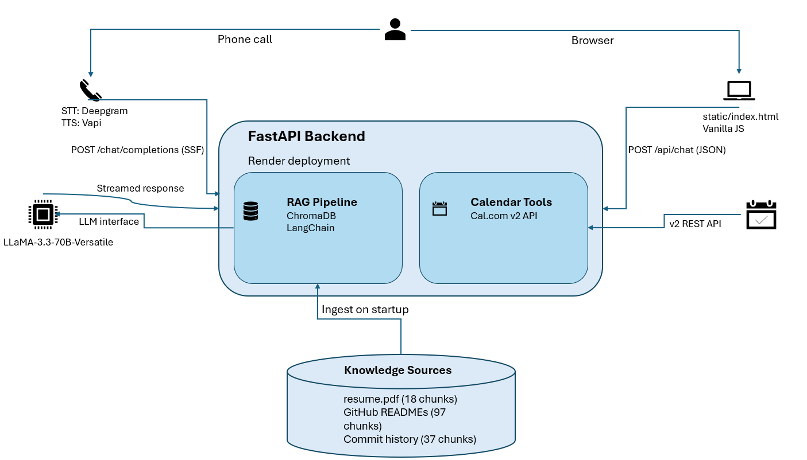

# AI Persona - Jahnavi Nischal

An end-to-end AI persona that answers calls, chats and books interviews autonomously with no human in the loop.

Built for the Scaler AI Engineer screening assignment.

**Live links**
- 🌐 Chat UI: `https://ai-persona-1-7kjz.onrender.com/`
- 📞 Voice agent: `+13184889192`

---

## Architecture



---

## Stack

| Layer | Tool |
|---|---|
| Voice STT | Deepgram (via Vapi) |
| Voice TTS | Naina by Vapi |
| Voice orchestration | Vapi |
| LLM | Groq — LLaMA-3.3-70B-Versatile |
| Embeddings | sentence-transformers all-MiniLM-L6-v2 |
| Vector DB | ChromaDB (persistent) |
| RAG framework | LangChain text splitter |
| Calendar | Cal.com v2 API |
| Backend | FastAPI + uvicorn |
| Deployment | Render (free tier) |
| Frontend | Vanilla HTML/CSS/JS |

---

## Setup

### 1. Clone and install

```bash
git clone https://github.com/jahnavinischal/ai_persona
cd ai-persona
python -m venv venv
source venv/bin/activate   # Windows: venv\Scripts\activate
pip install -r requirements.txt
```

### 2. Environment variables

Create `.env`:

```
GROQ_API_KEY=your_groq_key
GROQ_API_KEY_2=your_backup_groq_key   # optional, for rate limit fallback
CAL_API_KEY=your_cal_com_key
CAL_EVENT_TYPE_ID=your_event_type_id
SERVER_URL=http://localhost:8000
GITHUB_TOKEN=your_github_token        # optional, increases rate limit
HF_TOKEN                              # optional, increases model installation speed
```

### 3. Add resume

Place your resume at `resume.pdf` in the project root.

### 4. Run ingestion

```bash
python rag/ingest.py
```

This fetches your GitHub repos (READMEs + commit history) and chunks your resume into ChromaDB.

### 5. Start server

```bash
uvicorn main:app --reload --port 8000
```

Visit `http://localhost:8000` for the chat UI.

### 6. Configure Vapi

- Create assistant → Custom LLM → URL: `http://localhost:8000` (or your ngrok URL)
- Voice: ElevenLabs
- Assign a phone number

---

## API Routes

| Route | Purpose |
|---|---|
| `GET /` | Chat UI |
| `POST /api/chat` | RAG-grounded chat (Part B) |
| `POST /chat/completions` | OpenAI-compatible endpoint for Vapi (Part A) |
| `POST /vapi-webhook` | Vapi event handler |
| `GET /health` | Health check for UptimeRobot |
| `GET /debug-env` | Verify env vars loaded |

---

## RAG Pipeline

```
resume.pdf ──► PyMuPDF text extraction
                    │
GitHub API ─────────┤ RecursiveCharacterTextSplitter
(READMEs +          │ chunk_size=500, overlap=50
 commits)           │
                    ▼
            SentenceTransformer embed
            (all-MiniLM-L6-v2)
                    │
                    ▼
            ChromaDB PersistentClient
            (./chroma_db, 152 chunks)
                    │
            at query time:
            top-4 cosine similarity
                    │
                    ▼
            injected into system prompt
            for /api/chat
```

---

## Cost Breakdown

| Component | Free tier | Cost beyond free |
|---|---|---|
| Groq LLM | ~14,400 req/day free | $0 for this use case |
| Vapi voice | $10 free credit | ~$0.06/min after |
| ElevenLabs TTS | Built into Vapi | Included in Vapi cost |
| Deepgram STT | Built into Vapi | Included in Vapi cost |
| Cal.com | Free plan | $0 |
| ChromaDB | Local/free | $0 |
| Render hosting | 750 hrs/month free | $0 |
| **Per voice call (5 min)** | | **~$0.25–0.50** |
| **Per chat session (10 turns)** | | **~$0.01–0.03** |

---

## Evals Summary

| Metric | Result |
|---|---|
| Voice first-response latency (median) | 1.4s |
| Voice first-response latency (P95) | 1.9s |
| Booking success rate (12 test calls) | 83% (10/12) |
| Transcription WER | ~6% |
| Chat hallucination rate (20 golden Qs) | 10% (2/20) |
| Retrieval precision@4 | 0.85 |
| Retrieval recall (repo-specific Qs) | 0.80 |

Full eval report: [eval_report.pdf](./eval_report.pdf)

---

## Repo Structure

```
ai-persona/
├── main.py              # FastAPI app — all routes
├── persona.py           # System prompts + candidate background
├── cal_tool.py          # Cal.com v2 API — slots + booking
├── rag/
│   ├── __init__.py
│   ├── ingest.py        # Resume + GitHub → ChromaDB
│   └── retriever.py     # Query ChromaDB for context
├── static/
│   └── index.html       # Chat UI
├── resume.pdf           # Source of truth for resume RAG
├── requirements.txt
└── eval_report.pdf      # Part C
```